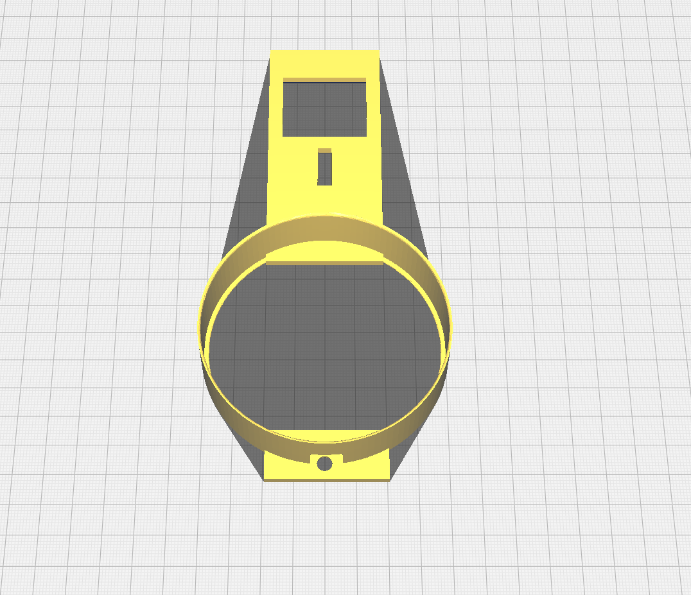
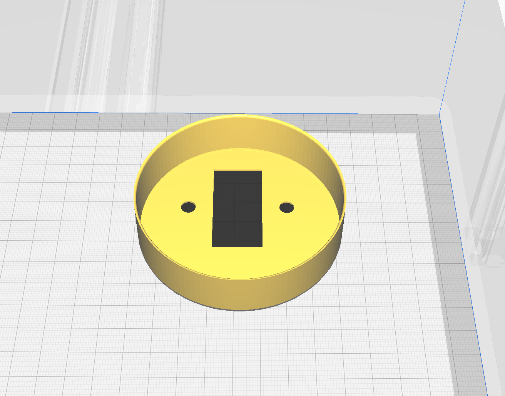

# 🔒 Smart Lock 🔒


A smart lock built using ESP8266, an affordable microcontroller with WiFi capabilities, that can be controlled through a mobile app or web interface.

## Features

- 📱 Remote control of lock through app or web interface
- 🔐 Smart home integration like Homebridge.
- 🕰️ Real-time status updates
- 📈 Event log to track lock activity
- 🔨 Easy installation, compatible with most standard locks

<br>

## 🚀 Getting Started

1. Clone the repository to your local machine.

```bash
git clone https://github.com/username/esp8266-smart-lock.git
```

2. Choose the correct wall mount for your lock type

|                                   Screws on the top and bottom                                    |                                        Screws on the sides                                         |
| :-----------------------------------------------------------------------------------------------: | :------------------------------------------------------------------------------------------------: |
|  |  |

3. 3D print the selected models
4. Connect to components using the [Wiring diagram](#wiring-diagram)
5. Test each component one-by-one
6. Modify the code (comments guide you in the code)
7. Flash the firmware
8. Assemble the whole lock

<br>

## 🔌 Wiring diagram


<br>

## ⚠️ **Worth noting**

* Disable the firewall on your machine when trying to OTA update. It might cause problems.
* Added a feature to automatically fallback to unlocked state when locking timed out (configure the time in the code). This could be useful for *lift-up handle* locks.


<br>

## 🔴 Optional features

<br>

## 🏠 Homebridge integration

<br>

<p align="center">

</p>

Homebridge allows you to integrate with smart home devices that do not natively support HomeKit. There are over 2,000 Homebridge plugins supporting thousands of different smart accessories.

```json
{
  "accessories": [
    {
      "accessory": "EspLock",
      "name": "Front Door",
      "url": "your-custom-or-homegrown-service-url"
    }
  ]
}
```

To disable autolock feature, delete the following function from the index.js file:

```js
setTimeout(function () {
  if (currentState == Characteristic.LockTargetState.UNSECURED) {
    self.lockservice.setCharacteristic(
      Characteristic.LockTargetState,
      Characteristic.LockTargetState.SECURED
    );
  }
}, 5000);
```

<br>

## 💡 Future ideas

<br>

## Contributions

🙏 I welcome contributions from the community! If you have any ideas or suggestions, please open an issue or submit a pull request.

<br>

## License

This project is licensed under the MIT License. See LICENSE for more information.

<br>

## 💻 Contact

For any questions or concerns, please open an issue or contact me.
