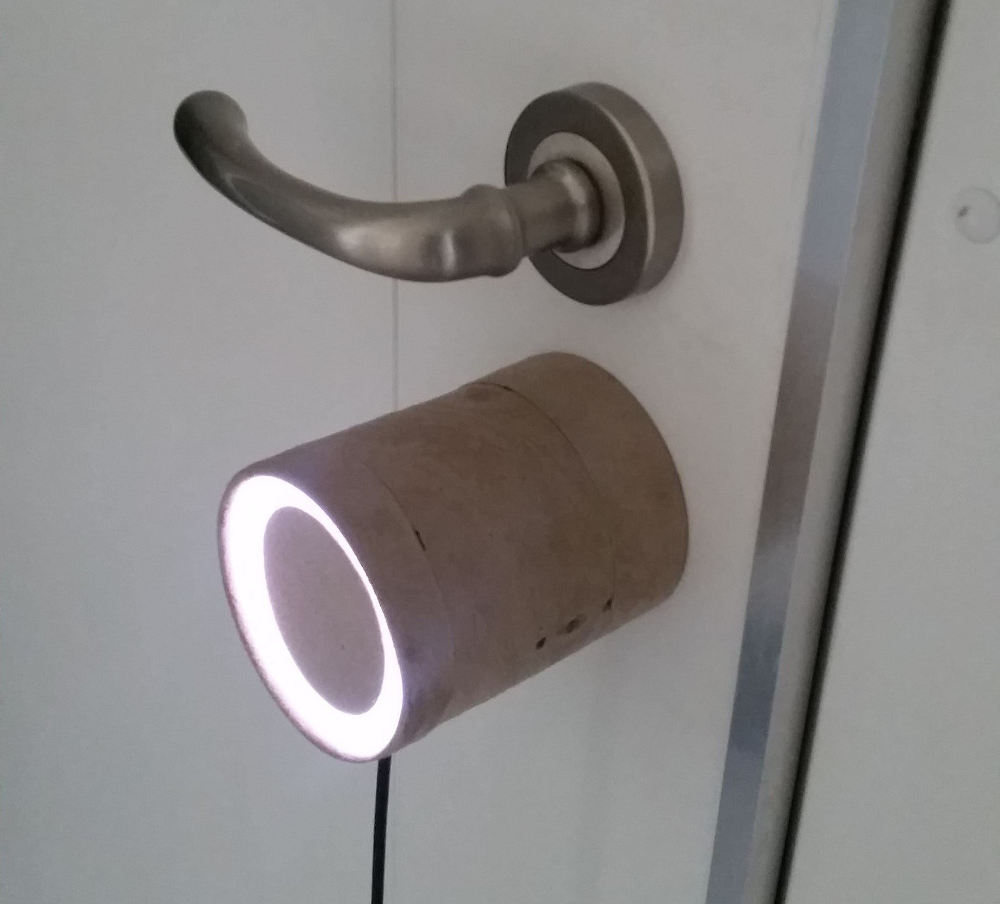
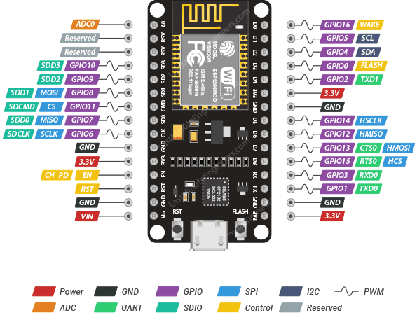
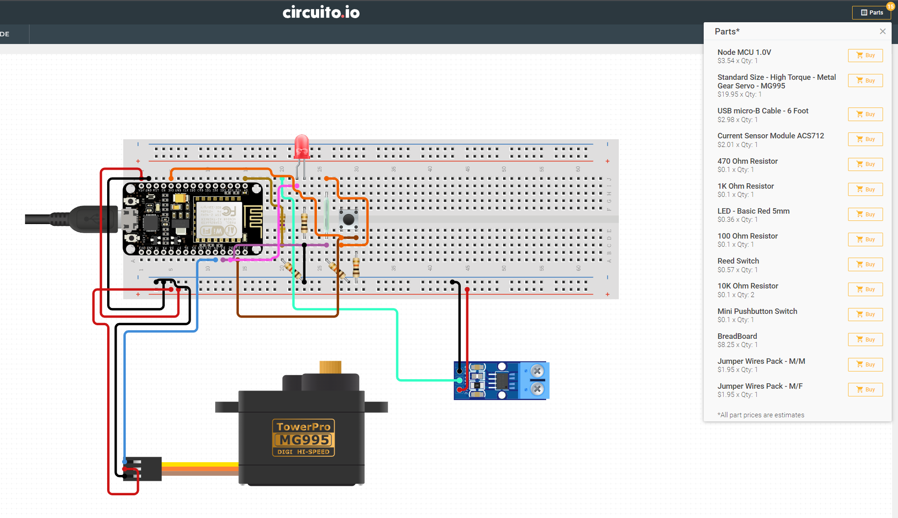

# 🔒 Smart Lock 🔒


A smart lock built using ESP8266, an affordable microcontroller with WiFi capabilities, that can be controlled through a mobile app or web interface.

## Features

- 📱 Remote control of lock through app or web interface
- 🔐 Smart home integration like Homebridge.
- 🕰️ Real-time status updates
- 📈 Event log to track lock activity
- 🔨 Easy installation, compatible with most standard locks

## 💭 Inspiration

The whole idea came from a [hackaday.io](https://hackaday.io/project/11917-smart-lock) project, huge thanks for providing the basic STL files and logic. I tried to further improve the project and make it possible to integrate it into existing smart home ecosystems like Apple HomeKit.

### **Furthermore, the objectives were almost identical:**

- Device must be cheap. This means no expensive motors or sensors can be used.
- Device must be presentable. I don't want to see any cables, electronics not even the motor itself on my apartment door (since it is a very small apartment).
- No modifications on door itself. I am a tenant at this apartment right now so I can't modify anything that can't be fixed.
- It should be secure. Most of the RF devices are vulnerable to replay attacks, the lock should be safe enough.

<p align="center">

</p>

<br>

## 🚀 Getting Started

1. Clone the repository to your local machine.

```bash
git clone https://github.com/username/esp8266-smart-lock.git
```

2. Choose the correct wall mount for your lock type

|               Screws on the top and bottom               |                    Screws on the sides                    |
| :------------------------------------------------------: | :-------------------------------------------------------: |
|  |  |

3. 3D print the selected models
4. Connect to components using the [Wiring diagram](#wiring-diagram)
5. Test each component one-by-one
6. Configure the parameters in the code
7. Flash the firmware
8. Assemble the whole lock

<br>

## 🔌 Wiring diagram

<h3 style="text-align: center;">⚠️ The wiring looks complicated, but it is not! With a little bit of knowledge, it is feasible. I recommend putting the circuit together one-by-one, so you can test every component. Designing a custom PCB would eliminate this issue... ⚠️</h3>

### **Things to keep in mind:**

- Current sensor outputs 0-5V, however the ESP's analogue-to-digital converter expects 0-3.3V. Thus, it is neccessary to use a voltage divider.
- Wiring diagram uses random digital ports, not the ones I defined in the code! Refer to the _default pins_ table.

<br>



| Pin on ESP | Pin in code |  Funcionality  |
| :--------: | :---------: | :------------: |
|     A0     |     A0      | Current sensor |
|     D4     |      2      |  Servo signal  |
|     D3     |      0      |  Reed sensor   |
|     D2     |      4      |     Button     |
|     A1     |      5      |      LED       |

<br>

<h3 style="text-align: center;">⚠️ IMPORTANT: both of the diagrams contain errors, the servo's VIN and ground terminals should have been connected to the current sensor's terminals! ⚠️</h3>

### **Minimum components required with basic functionality:**

<p align="center">

</p>

### **All funcionality:**

<p align="center">

</p>

<br>

## ⚠️ **Worth noting**

- Disable the firewall on your machine when trying to OTA update. It might cause problems.
- Added a feature to automatically fallback to unlocked state when locking timed out (configure the time in the code). This could be useful for _lift-up handle_ locks. (EXPERIMENTAL)
  

<br>

## 🔴 Optional features

- **Autolock:** it is possible to disable this feature or add bigger time delay
- **Sensor:** it is possible to add a Reel-relay making it possible to track the lock's state even opening/closing it in manual mode. See the source code for details. _However, if you decide not to use it, you do not have to change anything to get the lock working._
- **Button:** it enables the user to open or close the door from the inside manually without using the phone.

<br>

## 📙 API

Example request to lock the door:

```bash
curl -X POST http://your-ip-address -H "Content-Type: application/x-www-form-urlencoded" -d "state=locked"
```

Example request to get the current state:

```bash
curl -X GET http://your-ip-address
```

Example response:

```json
{
  "state": "locked",
  "statusCode": 200,
  "battery": 100
}
```

<br>

## 🏠 Homebridge integration

<br>

<p align="center">

</p>

Homebridge allows you to integrate with smart home devices that do not natively support HomeKit. There are over 2,000 Homebridge plugins supporting thousands of different smart accessories.

The lock uses the [EspLock](https://github.com/volca/homebridge-esplock) Homebridge plugin to integrate it into the Apple HomeKit ecosystem. Huge thanks to [volca](https://github.com/volca)!

Example configuration, it is possible to use a static IP address or the hostname:

```json
{
  "accessories": [
    {
      "accessory": "EspLock",
      "name": "Front Door",
      "url": "your-locks-ip-address-or-hostname"
    }
  ]
}
```

To disable autolock feature, delete the following function from the index.js file:

```js
setTimeout(function () {
  if (currentState == Characteristic.LockTargetState.UNSECURED) {
    self.lockservice.setCharacteristic(
      Characteristic.LockTargetState,
      Characteristic.LockTargetState.SECURED
    );
  }
}, 5000);
```

<br>

## 💡 Future ideas

- Making the housing sturdier and more robust to reduce wiggle
- Designing a custom PCB for easier installation

<br>

## Contributions

🙏 I welcome contributions from the community! If you have any ideas or suggestions, please open an issue or submit a pull request.

<br>

## License

This project is licensed under the MIT License. See LICENSE for more information.

<br>

## 💻 Contact

For any questions or concerns, please open an issue or contact me.
