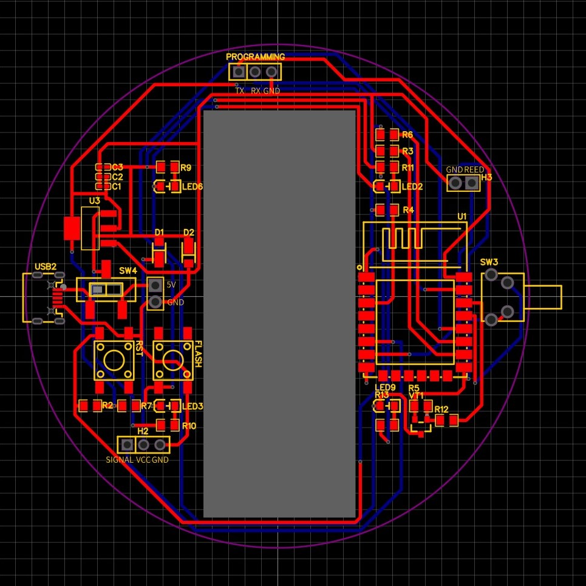
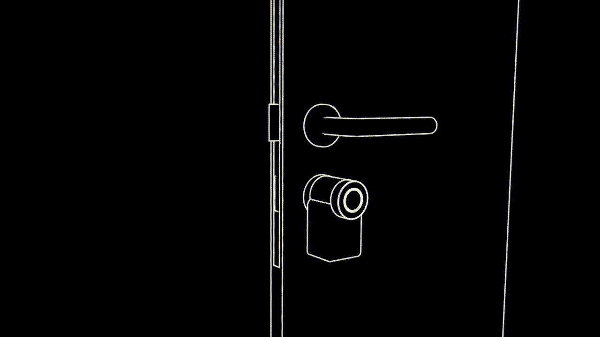

# 🔒 Smart Lock with Home Key support🔒


A smart lock built using ESP8266, an affordable microcontroller with WiFi capabilities, that can be controlled through a mobile app or web interface.

## Features

- 📱 Remote control of lock through app or web interface
- 🔐 Smart home integration like Homebridge.
- 🕰️ Real-time status updates
- 💳 Optional Home Key support
- 🔨 Easy installation, compatible with most standard locks

<br>

## 💭 Inspiration

The whole idea came from a [hackaday.io](https://hackaday.io/project/11917-smart-lock) project, huge thanks for providing the basic STL files and logic. I tried to further improve the project and make it possible to integrate it into existing smart home ecosystems like Apple HomeKit.

### **Furthermore, the objectives were almost identical:**

- Device must be cheap. This means no expensive motors or sensors can be used.
- Device must be presentable. I don't want to see any cables, electronics not even the motor itself on my apartment door (since it is a very small apartment).
- No modifications on door itself. I am a tenant at this apartment right now so I can't modify anything that can't be fixed.
- It should be secure. Most of the RF devices are vulnerable to replay attacks, the lock should be safe enough.

|                Inspiration - hackaday.io                |                    Latest version               |
| :-----------------------------------------------------: | :---------------------------------------------: |
|  |   |

<br>

## 🚀 Getting Started

1. Clone the repository to your local machine.

```bash
git clone https://github.com/peterrakolcza/SmartLock.git
```

2. 3D print the selected models
3. Order the custom PCB and the components from JLCPCB for example
4. Wait :(
5. Configure the parameters in the code
```
#ifndef STASSID
#define STASSID "*****" // CHANGE THIS
#define STAPSK  "*****" // CHANGE THIS
#endif

struct { 
  const int numberOfTurnsRequired = 2; // CHANGE THIS
  // CALIBRATE
  int TimeToLock = 1000;
  int TimeToUnlock = 1000;
} settings;
```
6. Flash the firmware
7. Assemble the whole lock
8. Calibration: 
     -  it is highly recommended to calibrate the smart lock at first boot by holding down side-button while powering it on. 
     - Before the calibration it will flash 3 times. 
     - After that it will try to lock the door until the user presses the side-button. 
     - It will flash 3 times again. 
     - Finally, it will try to unlock the door until the button is pressed. 
     - It will flash 3 times to indicate the end of the calibration process.
     - The smart lock now registered and saved the amount of time required to lock / unlock the door.
9. Integrate it into your existing smart home ecosystem using the API function or Homebrige with / without Home Key support

<br>

## ⚡ Custom PCB

You can just order my custom PCB assembled and flash the firmware. After that, connecting the sensors and servo using the header pins are easy.

<br>

|                easyEDA                |                     PCB               |
| :-----------------------------------------------------: | :---------------------------------------------: |
|                |      |

<br>

## 🔌 Pinout

<br>


| Pin on ESP | Pin in code |  Funcionality  |
| :--------: | :---------: | :------------: |
|     D6     |      12     |  Servo signal  |
|     D7     |      13     |  Reed sensor   |
|     D2     |      4      |     Button     |
|     D1     |      5      |      LED       |

<br>
<br>
<br>
<br>
<br>
<br>
<br>
<br>
<br>
<br>
<br>

## ⚠️ **Limitations**

A lift-up handle on a smart lock can introduce several challenges that affect usability, compatibility, and security. One primary issue is user convenience. The necessity to lift the handle adds an extra step to the process of locking or unlocking the door, which can be particularly inconvenient when users' hands are full, they are in a hurry, or when it's dark. This could prevent the smart lock to properly lock the door.

_A future feature is planned to solve this issue, by automatically falling back to unlocked state when locking failed._

<br>



<br>

## 📙 API

Example request to lock the door:

```bash
curl -X POST http://smartlock.local -H 'Content-Type: application/json' -d '{"state":"locked"}'
```

Example request to get the current state:

```bash
curl -X GET http://smartlock.local
```

Example response:

```json
{
  "state": "locked"
}
```

<br>

## 🏠 Homebridge integration

<br>

<p align="center">

</p>

Homebridge allows you to integrate with smart home devices that do not natively support HomeKit. There are over 2,000 Homebridge plugins supporting thousands of different smart accessories.

Homebridge is a lightweight Node.js server you can run on your home network that emulates the iOS HomeKit API. It supports Plugins, which are community-contributed modules that provide a basic bridge from HomeKit to various 3rd-party APIs provided by manufacturers of "smart home" devices.

You have 2 options to integrate the smart lock to your existing Apple HomeKit smart home:

### - **Home Key**


This all made possible by this project: [apple-home-key-reader](https://github.com/kormax/apple-home-key-reader) , thanks to [kormax](https://github.com/kormax). Furthermore, thanks for [nagolnad](https://github.com/nagolnad) for a [OrangePi Zero 2W Implementation](https://github.com/kormax/apple-home-key-reader/discussions/14) which was a great starting point!

Their project offers a demonstration of an Apple Home Key Reader built in Python. It includes:

- Fully functional Apple Home Key NFC authentication;
- NFC Express mode support;
- HAP configuration (as a virtual lock)

It's intended for makers and developers interested in building practical and user-friendly applications using this example.

To add Home Key support to this smart lock:
1. 3D print the case included in the repository
2. follow this guide: [OrangePi Zero 2W Implementation](https://github.com/kormax/apple-home-key-reader/discussions/14)
3. use the modified code included in the repository to make it compatible with this lock 

<br>
<br>
<br>
<br>

### - **EspLock**

The lock uses the [EspLock](https://github.com/volca/homebridge-esplock) Homebridge plugin to integrate it into the Apple HomeKit ecosystem. Huge thanks to [volca](https://github.com/volca)!

Example configuration, it is possible to use a static IP address or the hostname:

```json
{
  "accessories": [
    {
      "accessory": "EspLock",
      "name": "Front Door",
      "url": "http://smartlock.local"
    }
  ]
}
```

To disable autolock feature, delete the following function from the index.js file:

```js
setTimeout(function () {
  if (currentState == Characteristic.LockTargetState.UNSECURED) {
    self.lockservice.setCharacteristic(
      Characteristic.LockTargetState,
      Characteristic.LockTargetState.SECURED
    );
  }
}, 5000);
```

<br>

## Contributions

🙏 I welcome contributions from the community! If you have any ideas or suggestions, please open an issue or submit a pull request.

<br>

## License

This project is licensed under the MIT License. See LICENSE for more information.

<br>

## 💻 Contact

For any questions or concerns, please open an issue or contact me.
